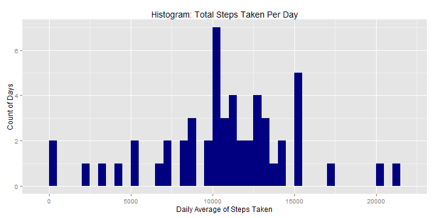
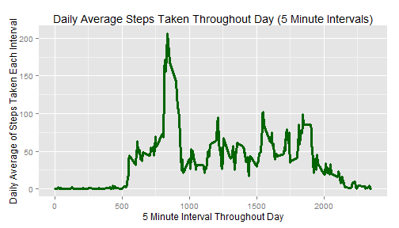
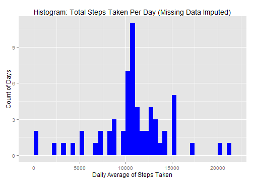

# Reproducible Research: Peer Assessment 1
#### Johns Hopkins Data Science [Coursera Platform]
#### Frank D. Evans (github.com/frankdevans)


## Project Overview
This assignment utilizes data from a single person's activity monitoring device.  The device
takes measurements in five minute intervals throughout the day.  The data used in this
analysis was collected during the months of October and November 2012 and braodly represent
the number of steps taken by the monitored individual in 5 minute intervals thorughout each
complete day.  

The data utilized consists of 17,568 observations of 3 data items:
- steps: number of steps taken in the subject 5 minute interval, missing data coded as 'NA'.
- date: string representation of the date the measurement was taken in a 'yyyy-mm-dd' format.
- interval: integer identifier of the 5 minute interval in which the measurement was taken.


## Loading and preprocessing the data
### Loading
Access the data via URL to download the ZIP file.  Load internet usage settings to prepare to
download a secure file, and load the raw data into a data frame.  To verify a successful load,
we'll look at the first few records.

```r
file_url <- "https://d396qusza40orc.cloudfront.net/repdata%2Fdata%2Factivity.zip"
setInternet2(TRUE)
download.file(file_url, "activity.zip")
activity <- read.csv(file = unz("activity.zip", "activity.csv"), header = TRUE, 
    na.strings = "NA")
head(activity)
```

```
##   steps       date interval
## 1    NA 2012-10-01        0
## 2    NA 2012-10-01        5
## 3    NA 2012-10-01       10
## 4    NA 2012-10-01       15
## 5    NA 2012-10-01       20
## 6    NA 2012-10-01       25
```


### Preprocessing
Next step is to pre-process the raw data into a tdy form best consumed by downstream analytics.
This code will convert the date column from a string to a date type, sort the table by date,
and create a second version of the data frame subsetted to only include records with a valid
value in the steps column (remove 'NA' records).  To verify a successful load, we'll look at
the first few records.

```r
activity$date <- as.Date(activity$date, "%Y-%m-%d")
activity <- activity[order(activity$date, activity$interval), ]
act_nonnull <- subset(activity, !is.na(activity$steps))
head(act_nonnull)
```

```
##     steps       date interval
## 289     0 2012-10-02        0
## 290     0 2012-10-02        5
## 291     0 2012-10-02       10
## 292     0 2012-10-02       15
## 293     0 2012-10-02       20
## 294     0 2012-10-02       25
```


## What is mean and median total number of steps taken per day?
In order to be able to calculate a mean and median at the day granularity, it is first necessary
to aggregate the data at the date level with a summation to get the total value across all
intervals for each day.  Then we can calculate the mean and median of the day-level aggregate.

```r
g_steps_sum <- aggregate(x = act_nonnull$steps, by = list(date = act_nonnull$date), 
    FUN = sum)
mean(g_steps_sum$x)
```

```
## [1] 10766
```

```r
median(g_steps_sum$x)
```

```
## [1] 10765
```


### Histogram
With this aggregate data we can now create a histogram of the steps taken per day.

```r
library(ggplot2)
ggplot(data = g_steps_sum, aes(x = x)) + geom_histogram(fill = "navy", binwidth = 500) + 
    ggtitle("Histogram: Total Steps Taken Per Day") + xlab("Daily Average of Steps Taken") + 
    ylab("Count of Days")
```

 


## What is the average daily activity pattern?
To illustrate the average daily activity pattern, it is necessary to perform a different 
aggregation on the data using a mean function across the days for each interval.  Then 
it is possible to plot the data with a time series plot across day intervals.

```r
g_steps_mean <- aggregate(x = act_nonnull$steps, by = list(time_interval = act_nonnull$interval), 
    FUN = mean)

ggplot(data = g_steps_mean, aes(x = time_interval, y = x)) + geom_line(color = "dark green", 
    size = 1.1) + ggtitle("Daily Average Steps Taken Throughout Day (5 Minute Intervals)") + 
    xlab("5 Minute Interval Throughout Day") + ylab("Daily Average of Steps Taken Each Interval")
```

 


The 5 minute interval with the maximum mean of steps taken is accessible by slicing the
table of mean aggregate data to only show the row where the maximum value exists.  By
showing the entire row, both the maximum value as well as the interval where it occurs
is shown.

```r
g_steps_mean[g_steps_mean$x == max(g_steps_mean$x), ]
```

```
##     time_interval     x
## 104           835 206.2
```


## Imputing missing values
### Quantify Missing Values in Dataset
To determine how many records will need to have step column data imputed for, we 
can sum the number of records in the originally loaded data set (before NA values
were removed) where the value of the data item is NA.

```r
sum(is.na(activity$steps))
```

```
## [1] 2304
```

### Impute Missing Data
For any missing values in the step data items, they will be imputed and plugged with
the average number of steps taken across all days for that interval that are not
missing.  To perform the imputation, the original dataframe is merged with the
aggregated data of mean steps by time interval.  The new column of mean number of
steps is given a more friendly name.  First, a duplicate of the steps column is
created where the imputed steps will be calculated so that the original data is
preserved.  Then all missing values are replaced directly with their merged 
counterpart mean value.  We can verify that the new column has successfully replaced
the missing values by calling the same sum function for missing values on the newly created
column with the imputed values.  The sum should return 0 if there are no missing values.

```r
act_impute <- merge(x = activity, by.x = "interval", y = g_steps_mean, by.y = "time_interval")
names(act_impute)[4] <- "g_mean_steps"
act_impute$steps_impute <- as.numeric(act_impute$steps)
act_impute$steps_impute[is.na(act_impute$steps_impute)] <- act_impute$g_mean_steps[is.na(act_impute$steps_impute)]
sum(is.na(act_impute$steps_impute))
```

```
## [1] 0
```


### Mean/Median Recalculations and Updated Histogram with Imputed Data
To understand key differences to the data caused by the imputation, we will recalculate the
aggregation of sums across the days.  Then we can use this new aggregate to once again calculate
the mean and the median number of steps per day with imputed data.

```r
g_steps_sum_impute <- aggregate(x = act_impute$steps_impute, by = list(date = act_impute$date), 
    FUN = sum)
mean(g_steps_sum_impute$x)
```

```
## [1] 10766
```

```r
median(g_steps_sum_impute$x)
```

```
## [1] 10766
```

Since the mean of steps for a given interval was used as the imputation method, it is not
surprising that the imputed values have the same mean as the earlier set with missing
data removed.  However, the additional data points imputed have slightly changed the 
median value where it has increase and now is inline with the mean.

To graphically see any considerable impact the imputation had on the data, we can
recalculate the same histogram we did earlier of the Daily Average of Steps Taken per
day, including the imputed values.

```r
ggplot(data = g_steps_sum_impute, aes(x = x)) + geom_histogram(fill = "blue", 
    binwidth = 500) + ggtitle("Histogram: Total Steps Taken Per Day (Missing Data Imputed)") + 
    xlab("Daily Average of Steps Taken") + ylab("Count of Days")
```

 


## Are there differences in activity patterns between weekdays and weekends?
To determine if there are differences in weekdays (Mon-Fri) vs weekends (Sat-Sun), we first
need to create a column of what day of the week each date in the dataset is.  Then merge
in against a reference frame of alignment of days to weekend or weekday status.  We then look
at a sample of the data to verify the new columns.

```r
act_impute$day_of_week <- weekdays(act_impute$date, abbreviate = TRUE)
ref_dow <- data.frame(day_of_week = c("Mon", "Tue", "Wed", "Thu", "Fri", "Sat", 
    "Sun"), dow_type = c("weekday", "weekday", "weekday", "weekday", "weekday", 
    "weekend", "weekend"))
act_impute <- merge(x = act_impute, by.x = "day_of_week", y = ref_dow, by.y = "day_of_week")
head(act_impute)
```

```
##   day_of_week interval steps       date g_mean_steps steps_impute dow_type
## 1         Fri      535    NA 2012-11-30        6.057        6.057  weekday
## 2         Fri     1755     0 2012-11-23       37.453        0.000  weekday
## 3         Fri      915     0 2012-11-16      108.113        0.000  weekday
## 4         Fri      805    NA 2012-11-09       68.208       68.208  weekday
## 5         Fri      525    NA 2012-11-30        2.962        2.962  weekday
## 6         Fri     1505    NA 2012-11-09       36.075       36.075  weekday
```


Then aggregate the means across each interval and day of week type, and again take a sample
look at the outcome frame.

```r
g_steps_mean_impute_wdwe <- aggregate(x = act_impute$steps_impute, by = list(interval = act_impute$interval, 
    dow_type = act_impute$dow_type), FUN = mean)
head(g_steps_mean_impute_wdwe)
```

```
##   interval dow_type       x
## 1        0  weekday 2.25115
## 2        5  weekday 0.44528
## 3       10  weekday 0.17317
## 4       15  weekday 0.19790
## 5       20  weekday 0.09895
## 6       25  weekday 1.59036
```


### Updated Panel Time-Series Plot
To see the differences between weekdays and weekend days, we can use a plot panel with
both time-series plots aligned by x coordinate (time interval) to make comparison direct.


```r
ggplot(data = g_steps_mean_impute_wdwe, aes(x = interval, y = x)) + geom_line(color = "dark orange", 
    size = 1.1) + facet_wrap(~dow_type, nrow = 2, ncol = 1) + ggtitle("Daily Average Steps Taken Throughout Day (5 Minute Intervals)") + 
    xlab("5 Minute Intervals Throughout Day") + ylab("Daily Average of Steps Taken Each Interval")
```

 


