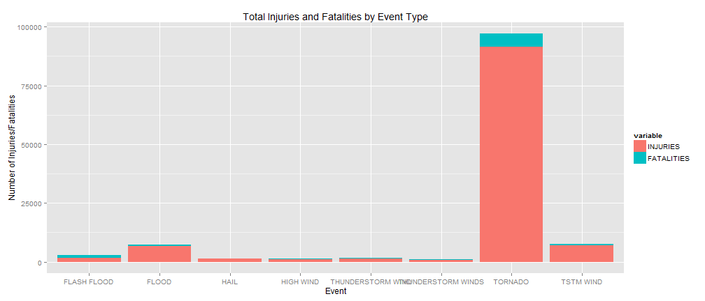
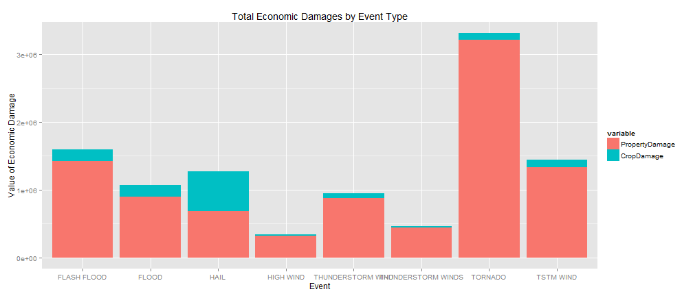

# The Costs of Storm Damage: Economic and Human
### Frank D. Evans - Johns Hopkins Data Science Specialization (Reproducible Research)

## Synopsis
This analysis is based on data from the National Oceanic and Atmospheric Administration
(NOAA) gathered data about storms over the last ~65 years.  The database tracks multiple
kinds of storms, their location, type, damage records, and other ancillary factors.  For
the history of tracked data, impact to population health was greatest among Tornadoes,
which accounted for a large share compared to other events of both fatalities and injuries.
Additionally, Tornadoes are the major event driving economic impacts, principally through
property damage.  Though less total economic damage, hail accounts for the largest portion
of crop damage among other analyzed factors.

Raw Data Link: https://d396qusza40orc.cloudfront.net/repdata%2Fdata%2FStormData.csv.bz2


## Data Processing

Load the dependent libraries.

```r
library(ggplot2)
library(reshape2)
```


Load the unzipped data into a dataframe, and convert dates to date object format.  Add an
additional column for the year extracted from the date.

```r
storm <- read.csv(file = bzfile("repdata-data-StormData.csv.bz2"), header = TRUE, 
    na.strings = "NA")
storm$BGN_DATE <- as.Date(storm$BGN_DATE, "%m/%d/%Y")
storm$END_DATE <- as.Date(storm$END_DATE, "%m/%d/%Y")
storm$YEAR <- as.POSIXlt(storm$BGN_DATE)$year + 1900
```


The data contains records for a very large array of Event Types.

```r
length(unique(storm$EVTYPE))
```

```
## [1] 985
```


To analyze those events with the greatest impact, we can restrict analysis by those events
the occur the most frequently and have caused the greatest damage.  To accomplish this,
a table of the occurence frequency of events is calculated, and ordered as a data frame,
restricting to a vector of the 8 most common occurring events to be used later as a filter.

```r
freq <- as.data.frame(table(storm$EVTYPE))
names(freq) <- c("EVTYPE", "COUNT")
freq <- freq[order(freq$COUNT, decreasing = TRUE), ]
freq_sel <- freq[1:8, "EVTYPE"]
freq_sel
```

```
## [1] HAIL               TSTM WIND          THUNDERSTORM WIND 
## [4] TORNADO            FLASH FLOOD        FLOOD             
## [7] THUNDERSTORM WINDS HIGH WIND         
## 985 Levels:    HIGH SURF ADVISORY  COASTAL FLOOD ... WND
```


## Results

### Question: Across the US, which events are most harmful with respect to population health?

To understand effect to population health, analysis will concentrate on the impact of Injuries
and Fatalities attributable to each event.

For the subject events, aggregate Injuries and Fatalities and merge into a common spline (to
ensure all events are included in resulting frame regardless of aggregation inclusion).  Then
the data is melted to put all measures in a common vector to more easily feed the graphics.

```r
agg_event <- data.frame(EVTYPE = freq_sel)
agg_event <- merge(agg_event, (aggregate(INJURIES ~ EVTYPE, data = storm, FUN = "sum")))
agg_event <- merge(agg_event, (aggregate(FATALITIES ~ EVTYPE, data = storm, 
    FUN = "sum")))
melt_event <- melt(data = agg_event, id.vars = c("EVTYPE"))
```


Plot Bar chart of the data to show both total impact as well as proportion by sub-factors.

```r
ggplot(data = melt_event, aes(x = EVTYPE)) + geom_bar(aes(y = value, fill = variable), 
    stat = "identity") + ggtitle("Total Injuries and Fatalities by Event Type") + 
    xlab("Event") + ylab("Number of Injuries/Fatalities")
```

 


In terms of both factors representing population health, Tornadoes relate to the major
share of injuries and fatalities.  Tornadoes are not only the largest event driving
negative effects to population health, they account for a larger share than the other 7 major
factors combined.  Additionally, as would be colloquially expected, there is a far larger
impact in terms of numbers of injuries than fatalities.  The relative value of them is not
a subject of comparison of this analysis, nor definiable by the scope of the data present.
However, give that both factor categories are at their highest levels attributable to
Tornadoes, the outcome of the claim is equivalent nevertheless.

### Question: Across the US, which events have the greatest economic consequences?

As sentinals for economic effect, the monetary value of property damage and crop damage was
aggreagated as attributible for each event, and then quantified as an overall impact.

The initial transformation and aggregation of the data uses a similar apprach as the previous
question for economic factors.

```r
agg_econ <- data.frame(EVTYPE = freq_sel)
agg_econ <- merge(agg_econ, (aggregate(PROPDMG ~ EVTYPE, data = storm, FUN = "sum")))
agg_econ <- merge(agg_econ, (aggregate(CROPDMG ~ EVTYPE, data = storm, FUN = "sum")))
names(agg_econ) <- c("EVTYPE", "PropertyDamage", "CropDamage")
melt_econ <- melt(data = agg_econ, id.vars = c("EVTYPE"))
```


The data is plotted with a bar chart to show scale and comparable effects.

```r
ggplot(data = melt_econ, aes(x = EVTYPE)) + geom_bar(aes(y = value, fill = variable), 
    stat = "identity") + ggtitle("Total Economic Damages by Event Type") + xlab("Event") + 
    ylab("Value of Economic Damage")
```

 


In terms of economic damage, Tornadoes once again account for the largest impact among the
other key factors.  Among key factors, the ratio of value of crop damages to property
damages is very small with the exception of hail.  With regard to hail, it's ratio of crop
damage to property damage is nearly equivalent.  


